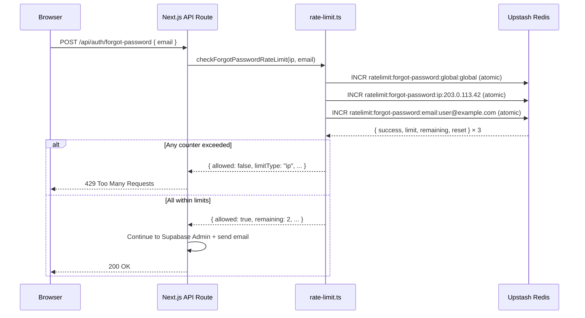

# Rate Limiting in This Boilerplate

> **Audience:** developers who are new to rate limiting and want to understand how it works here.

---

## Table of Contents

1. [What Is Rate Limiting?](#1-what-is-rate-limiting)
2. [Why Auth APIs Need It](#2-why-auth-apis-need-it)
3. [Technology Stack](#3-technology-stack)
4. [Algorithms Explained](#4-algorithms-explained)
5. [Defense-in-Depth: The Three-Tier Architecture](#5-defense-in-depth-the-three-tier-architecture)
6. [How a Request Flows Through Rate Limiting](#6-how-a-request-flows-through-rate-limiting)
7. [Per-API Reference](#7-per-api-reference)
8. [Fail-Open Policy](#8-fail-open-policy)
9. [The Ephemeral Cache](#9-the-ephemeral-cache)
10. [How to Add Rate Limiting to a New Endpoint](#10-how-to-add-rate-limiting-to-a-new-endpoint)
11. [How to Tune the Limits](#11-how-to-tune-the-limits)
12. [HTTP Response Format](#12-http-response-format)
13. [Key Files](#13-key-files)

---

## 1. What Is Rate Limiting?

Rate limiting is a technique that **controls how many requests a client can make to an API within a given time period.**

Think of it like a bank teller:

> "You can make 3 transactions in 15 minutes. After that, come back later."

Without rate limiting, a single attacker (or a bug in your own frontend code) can flood your API with thousands of requests per second, causing:
- Database overload
- Email provider quota exhaustion
- Degraded performance for all other users
- Successful brute-force or enumeration attacks

---

## 2. Why Auth APIs Need It

Authentication endpoints are high-value targets:

| Attack | What the attacker does | How rate limiting stops it |
|---|---|---|
| **Brute force** | Tries millions of passwords against one account | Per-email limit locks the account after N attempts |
| **Credential stuffing** | Tests stolen username+password pairs from other breaches | Per-IP + per-email limits slow the automated testing loop |
| **Email enumeration** | Sends signup/forgot-password requests to probe which emails are registered | Global + IP limits cap the probe rate |
| **Email bombing** | Floods a victim's inbox with reset or verification emails | Per-email limits cap how many emails can be sent to one address |
| **DDoS** | Thousands of IPs hammer an endpoint simultaneously | Global limit acts as a circuit breaker regardless of IP diversity |

---

## 3. Technology Stack

| Component | Technology | Purpose |
|---|---|---|
| **Rate limit counter storage** | [Upstash Redis](https://upstash.com/) | Serverless Redis. Stores per-IP, per-email, and global counters with automatic TTL-based expiry. |
| **Rate limit logic** | [@upstash/ratelimit](https://github.com/upstash/ratelimit) | TypeScript library that wraps Redis with sliding-window, fixed-window, and token-bucket algorithms. |
| **Redis client** | `src/lib/upstash.ts` | Configured Upstash Redis client (uses REST API — compatible with Edge and serverless). |
| **Config** | `src/constants/rate-limit.ts` | Single source of truth for all LIMIT, WINDOW, and Redis PREFIX values. |
| **Logic** | `src/lib/rate-limit.ts` | All limiter instances and `check*` functions consumed by API routes. |

---

## 4. Algorithms Explained

This codebase uses the **Sliding Window** algorithm everywhere. Here is how it compares to the alternatives:

### Sliding Window ✅ (used here)

```
Time →    |-------- 1 minute window --------|
          t=0   t=15  t=30  t=45  t=1:00
Requests:  ●●●               ●●

Result at t=1:00: window looks back to t=0:00.
All 5 requests are in the window. Counter = 5.
```

The window **rolls continuously** — it always looks back exactly WINDOW seconds from *now*. There are no sharp resets. This is the most accurate algorithm and prevents "boundary bursts" (see below).

---

### Fixed Window ❌ (not used)

```
Time →    |--- window 1 ---|--- window 2 ---|
          t=0             t=60            t=120

Requests:        ●●●●●       ●●●●●

Between t=55–60: 5 requests (limit = 5, allowed)
Between t=60–65: 5 requests (window resets, allowed)
→ 10 requests in 10 seconds — double the intended limit!
```

The **boundary burst** problem: an attacker can time requests around the window reset to get 2× the limit in a short period.

---

### Token Bucket (not used)

```
Bucket capacity: 10 tokens
Refill rate:     1 token / second

User sends 10 requests instantly → all 10 consumed → bucket empty
Next request must wait 1 second for 1 token to refill.
```

Good for APIs where occasional bursts are acceptable (e.g. a streaming API). Not ideal for auth, where we want strict thresholds without burst allowances.

---

## 5. Defense-in-Depth: The Three-Tier Architecture

For endpoints that receive an **email address** (signup, login, forgot-password, reset-password, resend-verification), we run **three independent checks simultaneously**:

```
                    Incoming request
                          │
          ┌───────────────┼───────────────┐
          ▼               ▼               ▼
    GLOBAL check      IP check       EMAIL check
    (all callers)   (per IP)       (per email)
          │               │               │
          └───────────────┼───────────────┘
                          │
                 Any exceeded? → 429
                 All passed?  → proceed
```

**Why run all three in parallel instead of stopping at the first failure?**

We use `Promise.all()` to fire all three Redis increments simultaneously. This **costs the same as one check** in terms of latency (one round-trip to Redis handles all three). If we checked sequentially (one by one), we would add 3× the latency to every request.

> Note: All three counters are always incremented, even if one fails. This is intentional — if the IP limit is exceeded, the email counter still records the attempt so it stays accurate.

---

For token-based endpoints (**verify-email, verify-otp, set-recovery-session**), there is no email in the request body, so only **two tiers** apply:

```
                    Incoming request
                          │
               ┌──────────┴──────────┐
               ▼                     ▼
         GLOBAL check            IP check
               │                     │
               └──────────┬──────────┘
                          │
                 Any exceeded? → 429
                 All passed?  → proceed
```

---

### Check Priority Order

When a request is blocked, the response reports **which tier tripped first**:

```
1. GLOBAL  (highest severity — system-wide attack)
2. IP      (single attacker)
3. EMAIL   (targeted attack on specific account)
```

This priority order makes logs and monitoring alerts easier to act on.

---

## 6. How a Request Flows Through Rate Limiting

Here is the full lifecycle for `POST /api/auth/forgot-password` as a concrete example:



---

## 7. Per-API Reference

| API Endpoint | Tiers | IP Limit | Email Limit | Global Limit | Notes |
|---|---|---|---|---|---|
| `POST /api/auth/signup` | Global + IP + Email | 3 / 15 min | 5 / 1 hr | 100 / 1 min | Conservative — real users sign up once |
| `POST /api/auth/login` | Global + IP + Email | 10 / 1 min | 5 / 1 min | 1000 / 1 min | Email limit is strictest — anti credential-stuffing |
| `POST /api/auth/forgot-password` | Global + IP + Email | 3 / 15 min | 5 / 1 hr | 100 / 1 min | Protects email quota and victim's inbox |
| `POST /api/auth/reset-password` | Global + IP + Email | 5 / 15 min | 5 / 1 hr | 100 / 1 min | User already authenticated via recovery session |
| `POST /api/auth/resend-verification` | Global + IP + Email | 10 / 1 hr | 3 / 1 hr | 100 / 1 hr | Generous per-IP for shared networks |
| `GET /api/auth/verify-email` | Global + IP | 30 / 1 hr | — | 2000 / 1 hr | Token-based, no email field, user clicks from email |
| `POST /api/auth/verify-otp` | Global + IP | 30 / 1 hr | — | 2000 / 1 hr | Token-based, mirrors verify-email |
| `POST /api/auth/set-recovery-session` | Global + IP | 20 / 15 min | — | 1000 / 15 min | Credential-bearing token exchange |

### Redis Key Patterns

Every rate limit counter lives in Upstash Redis under a key like:

```
<PREFIX><identifier>
```

Examples:
```
ratelimit:signup:ip:203.0.113.42
ratelimit:signup:email:user@example.com
ratelimit:signup:global:global
ratelimit:forgot-password:ip:203.0.113.42
ratelimit:login:email:user@example.com
```

Keys expire automatically when the window elapses (Redis TTL is managed by `@upstash/ratelimit`).

---

## 8. Fail-Open Policy

Every `check*RateLimit` function wraps its Redis calls in a `try/catch`. If Redis is unreachable, the function **returns `{ allowed: true }`** — the request is permitted to continue.

```typescript
} catch (error) {
  // FAIL-OPEN: if Redis is unreachable, allow the request.
  console.error(`[rate-limit] ${context} check failed — failing open:`, error);
  return { allowed: true };
}
```

**Why fail open?**

| Policy | During Redis outage | Trade-off |
|---|---|---|
| **Fail open** ✅ (used here) | Rate limits not enforced | Users can still log in / sign up |
| **Fail closed** | All requests rejected with 429 | 100% of users are locked out |

For an auth boilerplate, keeping users logged in / able to log in is more important than strict enforcement during an edge case outage. If you have stricter security requirements, switch the catch block to return `{ allowed: false }`.

---

## 9. The Ephemeral Cache

Each `Ratelimit` instance is created with:

```typescript
ephemeralCache: new Map()
```

This is an **in-memory (in-process) cache** layer that stores the result of the last Redis response for a very short duration (milliseconds). It prevents redundant Redis round-trips if the same serverless function instance processes the same identifier twice in rapid succession.

**Important limitation:** serverless platforms (Vercel, etc.) can spin up dozens of isolated function instances. Each has its own `Map`. The ephemeral cache is **not shared** across instances — it only helps within a single function invocation, not across them. Real cross-instance enforcement always goes through Redis.

---

## 10. How to Add Rate Limiting to a New Endpoint

Follow these steps to add rate limiting to a new API route:

### Step 1 — Add config to `src/constants/rate-limit.ts`

```typescript
MY_NEW_ENDPOINT: {
  IP: {
    LIMIT: 5,          // How many requests?
    WINDOW: "1 h",     // In what time period?
    PREFIX: "ratelimit:my-new-endpoint:ip:",
  },
  GLOBAL: {
    LIMIT: 500,
    WINDOW: "1 h",
    PREFIX: "ratelimit:my-new-endpoint:global:",
  },
  // Add EMAIL tier here if the endpoint accepts an email field
},
```

### Step 2 — Add limiter instances and a check function to `src/lib/rate-limit.ts`

```typescript
// ── MY NEW ENDPOINT ────────────────────────────────────────────
const myNewEndpointIpLimiter     = createLimiter(RATE_LIMIT_CONFIG.MY_NEW_ENDPOINT.IP.LIMIT,     RATE_LIMIT_CONFIG.MY_NEW_ENDPOINT.IP.WINDOW,     RATE_LIMIT_CONFIG.MY_NEW_ENDPOINT.IP.PREFIX);
const myNewEndpointGlobalLimiter = createLimiter(RATE_LIMIT_CONFIG.MY_NEW_ENDPOINT.GLOBAL.LIMIT, RATE_LIMIT_CONFIG.MY_NEW_ENDPOINT.GLOBAL.WINDOW, RATE_LIMIT_CONFIG.MY_NEW_ENDPOINT.GLOBAL.PREFIX);

export async function checkMyNewEndpointRateLimit(ip: string): Promise<RateLimitCheckResult> {
  return checkTwoTierRateLimit(myNewEndpointGlobalLimiter, myNewEndpointIpLimiter, ip, "my-new-endpoint");
  // Use checkThreeTierRateLimit(...) if there's also an email argument
}
```

### Step 3 — Call it in your API route

```typescript
import { checkMyNewEndpointRateLimit } from "@/lib/rate-limit";
import { getClientIp } from "@/lib/client-ip";

export async function POST(request: NextRequest) {
  const clientIp = getClientIp(request);

  const rateLimitResult = await checkMyNewEndpointRateLimit(clientIp);

  if (!rateLimitResult.allowed) {
    const retryAfter = rateLimitResult.resetAt
      ? Math.ceil((rateLimitResult.resetAt.getTime() - Date.now()) / 1000)
      : 60;

    return NextResponse.json(
      { error: "Too Many Requests", message: "Please try again later." },
      {
        status: 429,
        headers: {
          "Retry-After": retryAfter.toString(),
          "X-RateLimit-Limit": rateLimitResult.limit?.toString() ?? "0",
          "X-RateLimit-Remaining": rateLimitResult.remaining?.toString() ?? "0",
        },
      }
    );
  }

  // ... rest of handler
}
```

### Step 4 — Update this document

Add your new endpoint to the **Per-API Reference** table in **Section 7** above.

---

## 11. How to Tune the Limits

When adjusting limits, consider the following questions:

| Question | Guidance |
|---|---|
| How often does a real user do this per hour? | Set the limit to ~3–5× that number for comfort |
| Is the endpoint expensive? (emails, DB writes, external API calls) | Be conservative — lower limits |
| Is the endpoint frequently retried on error? (e.g. OTP entry) | Be slightly more generous |
| Are users likely to be on shared IPs? (corporate NAT, university) | Increase IP limit; tighten email limit instead |
| Is this endpoint primarily machine-to-machine? | Much higher global limits may be appropriate |

After changing limits, **redeploy** — there is no runtime config reload. Existing Redis keys will continue with old counters until their window expires.

---

## 12. HTTP Response Format

When a request is blocked, the API returns:

```http
HTTP/1.1 429 Too Many Requests
Retry-After: 245
X-RateLimit-Limit: 3
X-RateLimit-Remaining: 0
X-RateLimit-Reset: 1710747800000

{
  "error": "Too Many Requests",
  "message": "You have exceeded the rate limit. Please try again later.",
  "retryAfter": 245,
  "limit": 3,
  "remaining": 0
}
```

Clients should read `Retry-After` (seconds until reset) and display a user-friendly message rather than retrying immediately.

---

## 13. Key Files

| File | Purpose |
|---|---|
| [`src/constants/rate-limit.ts`](../src/constants/rate-limit.ts) | All `LIMIT`, `WINDOW`, and `PREFIX` configuration values |
| [`src/lib/rate-limit.ts`](../src/lib/rate-limit.ts) | Ratelimit instances, generic helpers, and all `check*` exports |
| [`src/lib/upstash.ts`](../src/lib/upstash.ts) | Upstash Redis client setup |
| [`src/lib/client-ip.ts`](../src/lib/client-ip.ts) | Extracts the real client IP from request headers |
| [`src/app/api/auth/signup/route.ts`](../src/app/api/auth/signup/route.ts) | Example: three-tier rate limiting applied |
| [`src/app/api/auth/verify-email/route.ts`](../src/app/api/auth/verify-email/route.ts) | Example: two-tier rate limiting applied |
| [rate-limiting-reference.md](rate-limiting-reference.md) | Per-API limits, Redis key patterns, HTTP 429 contract |

